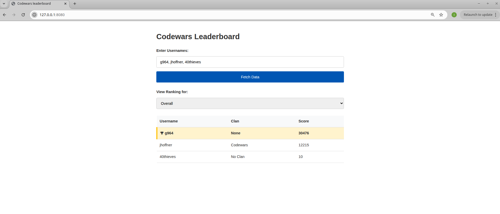
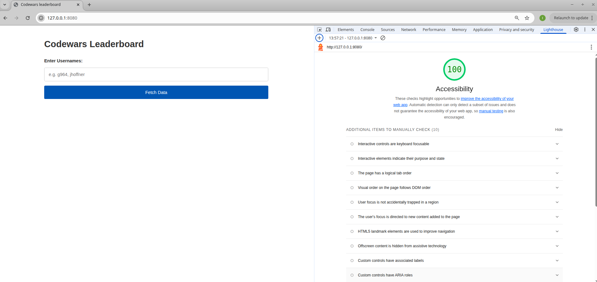
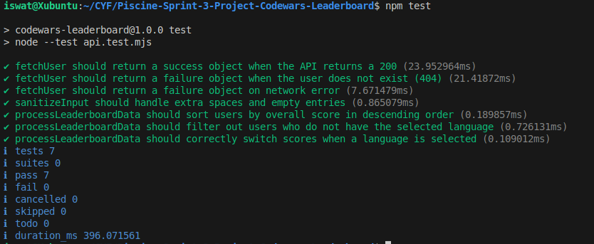

# Testing Documentation - Codewars Leaderboard

### Rubric Requirements & Testing Methods

1. **Accepts comma-separated list of users:**
   - _Manual Test:_ Entered "g964, jhoffner" in the input. Verified that both names were processed.
   - _Unit Test:_ `sanitizeInput` in `api.test.mjs` verifies that spaces and empty commas are handled correctly.

2. **Fetches data from Codewars API:**
   - _Manual Test:_ Verified via Network Tab that requests are sent to `https://www.codewars.com/api/v1/users/`.
   - _Unit Test:_ `fetchUser` in `api.test.mjs` uses `nock` to simulate successful API responses.

3. **Drop-down with language rankings + overall:**
   - _Manual Test:_ Searched for users with different languages and verified the dropdown populated dynamically.

4. **Default ranking is overall:**
   - _Manual Test:_ Verified that on initial fetch, the table displays "Overall" scores before any dropdown interaction.

5. **Table with Username, Clan, and Score:**
   - _Manual Test:_ Verified table headers and content mapping.

6. **Changing ranking updates the table:**
   - _Manual Test:_ Selected "JavaScript" from the dropdown and verified scores changed to JS-specific scores.

7. **Sorted highest to lowest:**
   - _Manual Test:_ Verified visually that users are displayed in descending score order.
   - _Unit Test:_ **Unit tests in `api.test.mjs`**. The `processLeaderboardData` test confirms that users are sorted correctly from highest to lowest score.

8. **Users without a ranking are hidden:**
   - _Manual Test:_ Selected a language only one user had; verified other users disappeared from the table.
   - _Unit Test:_ **Unit tests in `api.test.mjs`**. The `processLeaderboardData` test confirms that users without the selected language are filtered out.

9. **Top user is visually highlighted:**
   - _Manual Test:_ Verified that the `winner-highlight` CSS class is applied to the first row (index 0).
     

10. **100 Accessibility in Lighthouse:**
    - _Manual Test:_ I ran the Chrome DevTools Lighthouse audit in "Navigation" mode for "Mobile" and "Desktop".
    - _Result:_ I achieved a score of 100 by fixing color contrast on buttons and increasing touch target sizes.
      

11. **Unit tests for non-trivial function:**
    - _Unit Test:_ **Unit tests in `api.test.mjs`**. Specifically tested `processLeaderboardData`, which handles the complex logic of mapping raw API data, filtering by language, and sorting scores.
      

12. **Message for non-existent users:**
    - _Manual Test:_ Entered "invalid_user_123" and verified the UI message appeared using the `wrongName` variable.

13. **API/Network error message:**
    - _Manual Test:_ Used Chrome DevTools "Offline" mode and verified the `displayGeneralError` message appeared.
